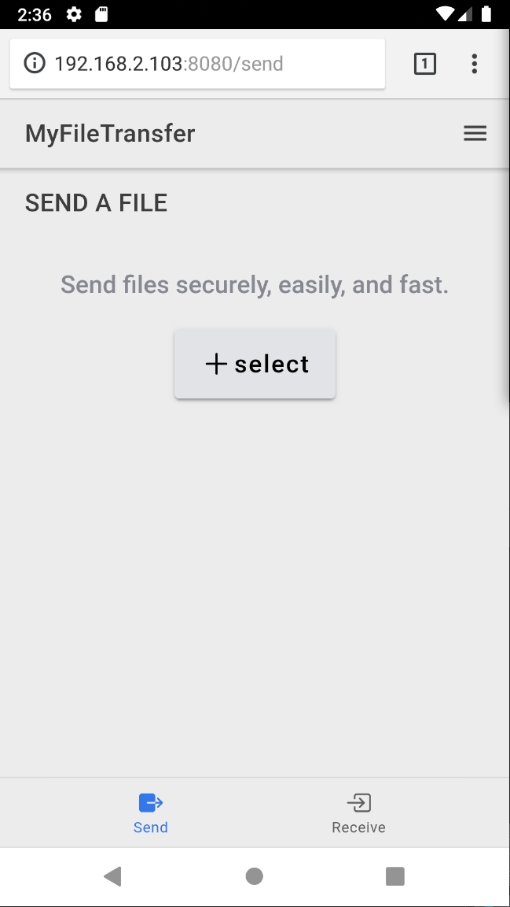
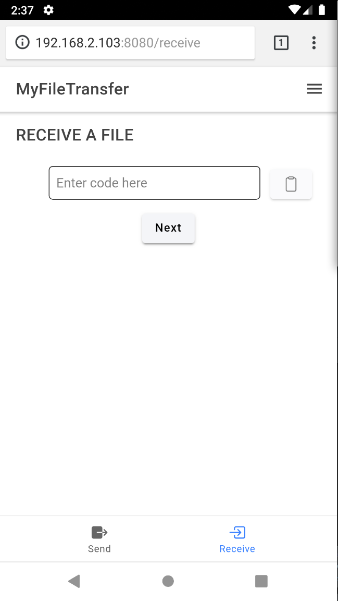

# MyFileTransfer

File transfer app that uses the magic wormhole protocol and ionic/vue UI framework.




## Development Setup

### Getting it running on a local computer

You need to run a local copy of mailbox server and a relay server. To do that run:
```
yarn compose:up -d
```

and then do:

```
yarn serve:worker
```

and now do

```
yarn install
yarn run serve
```

After this, open a browser and point it to `https://localhost:8080`.

